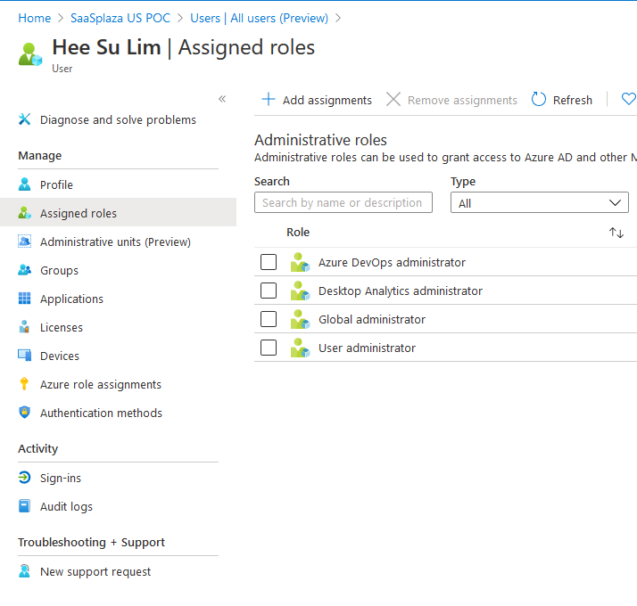
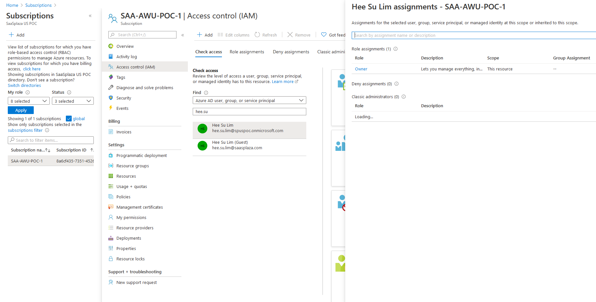
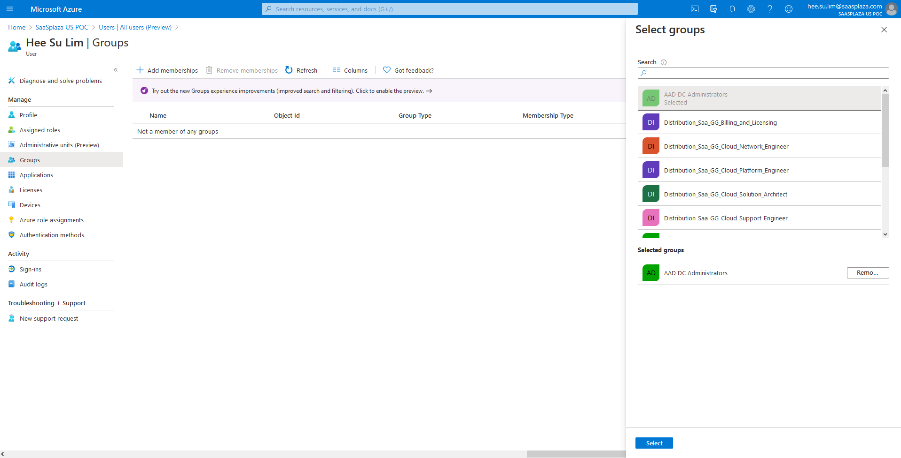
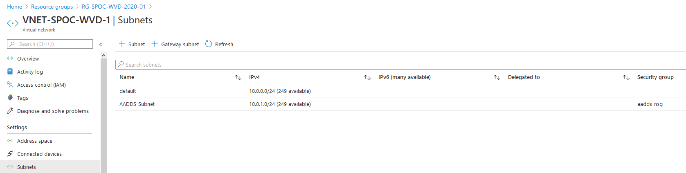
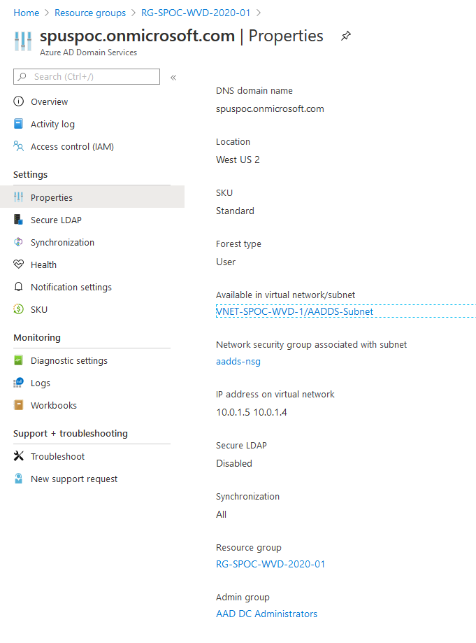
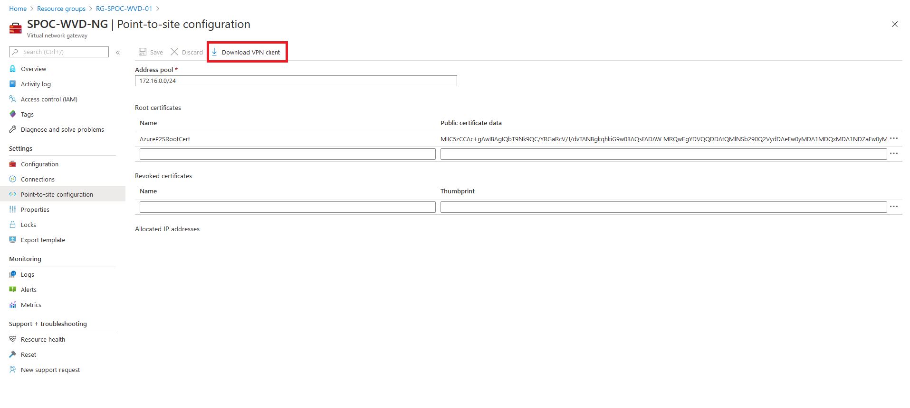
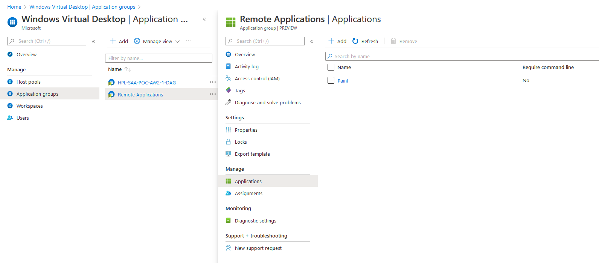

# Windows Virtual Desktop Deployment Tutorial

## Introduction
Windows Virtual Desktop (WVD) is a virtualized desktop service provided in Azure Cloud. This tutorial will cover the configuration and creation of WVDs in several parts:
1. **Initial Consent, Permissions, and Registration Requirements Setup**
2. **Virtual Network Setup and Deployment**
3. **Domain Controller Setup - Azure AD Domain Services or Azure VM DC**
4. **Host Pool, App Group, and User Setup and Deployment**
    * ***Optional:*** **ARM Template Host Pool Deployment**
5. **Accessing Windows Virtual Desktop Environment**
6. **Optional Configurations and Setups**

## 1. Initial Consent, Permissions, and Registration Requirements Setup
In order to complete WVD setup, there are a couple of prerequisites to fulfill:
1. You should have access to an account with permissions for resource provider management, virtual machine creation, and group assignments at the AD level. Generally speaking, this will be an account with Global Administrator role in your AD and Owner role in the Azure subscription you're setting up WVD.


2. If you plan to use Azure AD Domain Services, have access to an account that is part of the **AAD DC Administrators** group or be able to put users into that group, so that it can facilitate domain joins for VMs in our host pools. The specific group with domain join authority can be edited by configuring AADDS later.

3. Make sure that **Microsoft.DesktopVirtualization** and **Microsoft.AAD** is registered under **Resource providers** in your subscription.

**Additional Tips**: 
* It's recommended that virtually all resources and services in this tutorial be deployed in the same region and resource group.

## 2. Virtual Network Setup and Deployment
A Virtual Network is required to utilize a DC or Azure AD Domain Services, as well as for the creation of VMs in our host pools (for domain joins). This section will thus go over the creation of a Virtual Network.

### Deploying a Virtual Network
To deploy a Virtual Network:
1. Within the Azure Portal, use the search bar to go to the Virtual Networks overview page.
2. Select **Add**.
3. Fill out the requisite fields under the **Basics** tab:
    * **Subscription**: Enter the subscription you'd like the resource to be in. *Ex: SAA-AWU-POC-1*
    * **Resource group**: Enter the resource group you'd like the resource to be in. *Ex: RG-SPOC-AWU-01*
    * **Name**:  Enter the name of the Virtual Network. *Ex: VNET-SPOC-AWU-01*
    * **Region**: Enter the region you'd like the resource to be in. *Ex: West US*
4. Fill out the requisite fields under the **IP Addresses** tab:
    * **IPv4 address space**: Enter the address space you'd like. *Ex: 10.0.0.0/16*
    * **Subnet name**: Select **add** to enter a subnet. Create both a default subnet and an Azure AD Domain Services subnet if you plan to use that method later. *Ex: Name: default - Range: 10.0.0.0/24, Name: AADDS-Subnet - Range: 10.0.1.0/24*
5. Select **Review + create**. Once validation is finished, select **Create**. Wait for the deployment to finish.


## 3. Domain Controller Setup - Azure AD Domain Services or Azure VM DC
Windows Virtual Desktop requires an Active Directory (either on-prem or on an Azure VM) or Azure AD Domain Services to function correctly. We will be going over both methods below:

### Azure AD Domain Services (AADDS) Method
To deploy Azure AD Domain Services:
1. Within the Azure Portal, use the search bar to go to the Azure AD Domain Services overview page.
2. Select **Add**.
3. Fill out the requisite fields under the **Basics** tab:
    * **Subscription**: Enter the subscription you'd like the service to be in. *Ex: SAA-AWU-POC-1*
    * **Resource Group**: Enter the resource group you'd like the service to be in. *Ex: RG-SPOC-AWU-01*
    * **DNS domain name**: Enter the DNS domain name. Most likely, this will just be the built-in domain name of the directory with a .onmicrosoft.com suffix. Custom domain names can be used if added to the **Custom domain names** section in Azure AD. *Ex: spuspoc.onmicrosoft.com*
    * **SKU**: Select the SKU you'd like for the service. Following the **Help me choose a SKU** link will provide pricing and performance comparisons. *Ex: Standard*
    * **Forest type**: Select **User**.
4. Fill out the requisite fields under the **Networking** tab:
    * **Virtual Network**: Select the Virtual Network created as part of **Virtual Network Setup and Deployment** above. *Ex: VNET-SPOC-AWU-01*
    * **Subnet**: Select the Azure AD Domain Service subnet from your Virtual Network. *Ex: Name: AADDS-Subnet - Range: 10.0.1.0/24*
5. Fill out the requisite fields under the **Administration** tab:
    * Everything can be left by its defaults here. Uncheck groups you'd not like notified. Additionally, add email addresses as necessary.
6. Fill out the requisite fields under the **Synchronization** tab:
    * **Synchronization type**: Select **All** if you'd like everyone in Azure AD to be sync'd to AADDS. Select **Scoped** if you'd rather sync AD groups instead.
    * If you chose **Scoped**, fill out:
        * **Synchronization scope**: Select **Select groups**, then **Add groups** to add user groups to be synchronized.
7. Select **Review + create**. Once validation is finished, select **Create**, and in the following prompt, **OK**. Wait for the deployment to finish - about 30-40 minutes.
8. Once deployment is finished, select **Go to resource**. Wait for the managed domain to be provisioned - this can take 30-40 minutes on top of the deployment.
9. Once provisioning is finished, select **Configure** under a message box about DNS updates at the overview page. Azure will automatically update the Virtual Network by adding two new addresses to the DNS blade of the previously created VNet. **Make sure there are no other addresses! External addresses like 8.8.8.8 (Google's DNS) will cause errors in the VM domain join process.**
10. Note that, to use AADDS, users must reset their passwords to force a password hash synchronization. Otherwise, AD users will not be able to connect to AADDS and therefore the WVD. Refer to documentation [here](https://aka.ms/aadds-pwsynccloud) and [here](https://aka.ms/aadds-pwsync) for password hash synchronizing cloud-only and on-prem users respectively.

**Note**: AADDS synchronizes one-way from Azure AD to AADDS, meaning Azure AD is leading. In other words, one must add users through Azure AD (and be assigned to a group if you chose scoped synchronization) to create users for WVD - those users can then be assigned to application groups (covered later, after host pool creation.)



### Domain Controller Method
If you don't want to use AADDS, we must create a VM and set it up as a DC to create an AD to sync with Azure. Note that this method is much more involved - a VM must be provisioned, assigned to the DC role, and setup with Azure AD Connect Sync. Additionally, a VPN must be created to secure the connection to the DC, which involves more steps like certificate management.

To setup a DC on an Azure VM:
1. Within the Azure Portal home page, select **Virtual Machines** from the left side of the screen, then **Add**.
2. Fill out the requisite fields under the **Basics** tab:
    * **Subscription**: Enter the subscription you'd like to service to be in. *Ex: SAA-AWU-POC-1*
    * **Resource group**: Enter the resource group you'd like the service to be in. *Ex: RG-SPOC-AWU-01*
    * **Virtual machine name**: Enter a descriptive name for the VM to be our DC. *Ex: WVD-DC-01*
    * **Region**: Select the region you'd like the VM to be in. *Ex: West US*
    * **Availability options**: Select **No inifrastructure redundancy required**.
    * **Image**: Select **Windows Server 2019 Datacenter**.
    * **Size**: Select the size you'd like to VM to be. *Ex: D2s_v3*
    * **Username**: Enter the username of the administrator account for this VM. *Ex: wvdadmin*
    * **Password**: Enter the password for the administrator account for this VM. Note the credentials for this VM, as you'll need it later when connecting to it to set it up as a DC.
    * **Confirm password**: Enter the password again.
    * **Public inbound ports**: Select **None**.
    * **Already have a Windows Server license?**: Select **Yes** or **No** depending on whether you have a Windows Server license already. If **Yes**, confirm by checking the box that appears.
3. Fill out the requisite fields under the **Disks** tab:
    * **OS disk type**: Select a disk type. *Ex: Standard SSD*
    * **Encryption type**: Select **(Default)**.
    * Under the Data disks section, select **Create and attach a new disk** - we'll be making a disk to store AD/DC logs and other information. We can't use the automatically generated OS disk as it has caching, which might result in corruption on unexpected shutdowns. Fill out the following fields:
        * **Name**: Enter a name for the disk. *Ex: WVD-DC-01-Disk*
        * **Source type**: Select **None (empty disk)**
        * **Size**: Select a size for the disk. *Ex: 512 GiB Standard SSD*
        * **Encryption type**: Select **(Default)**.
    * Select **OK** to return to the VM configuration screen.
    * Make sure that **Host caching** is set to **None** for our newly created disk.
4. Fill out the requisite fields under the **Networking** tab:
    * **Virtual network**: Select the Virtual Network that you previously created. *Ex: VNET-SPOC-AWU-01*
    * **Subnet**: Select **default (10.0.0.0/24)** or whatever equivalent you set as the subnet for your Virtual Network.
    * **Public IP**: Select **None**.
    * Leave everything else on its defaults.
5. Skip **Management**, **Advanced**, and **Tags** unless you wish to use them, then select **Review + create**. Once validation is finished, select **Create**.
6. Once deployment is finished, select **Go to resource**.
7. Select the **Networking** blade on the left, then **Network interface** in blue text that was generated with the VM.
8. Select the **IP configurations** blade on the left, then **ipconfig1**.
9. Under **Private IP address settings**, change the **Assignment** to **Static**. Note the IP address of the VM. Select **Save**.
10. Wait for the changes to save, then select your **Virtual network/subnet** in blue text.
11. We will now enter the DC VM as our DNS server for the Virtual Network. Select the **DNS servers** blade on the left.
12. Select the **Custom** radio dial, then enter the IP address you noted of the VM we just created. Also enter **8.8.8.8** (Google's DNS) so that our DC has internet access - **remove this later if VM domain joins are failing.** Select **Save**. *Ex: 10.0.0.4*
13. Once the changes are saved, select the **Subnets** blade on the left.
14. Select **Gateway subnet** and enter **10.0.1.0/24** as the **Address range**. Leave everything else on its defaults. Select **OK**. 

Next, we set up our VPN by utilizing Azure's **Virtual Network Gateway (VNG)**.
1. Using the search bar, go to the Virtual Network Gateways overview page.
2. Select **Add**.
3. Fill out the requisite fields under the **Basics** tab - leave unmentioned fields by their defaults:
    * **Subscription**: Enter the subscription you'd like the VNG to be in.
    * **Resource group**: This will be filled in automatically once you select your VNET.
    * **Name**: Enter a name for your VNG.
    * **Region**: Enter the region you'd like your VNG to be in.
    * **SKU**: Select **Basic** unless another SKU is necessary.
    * **Virtual network**: Select the Virtual Network you previously created.
    * **Subnet**: Select the **Gateway Subnet** we previously created - likely 10.0.1.0/24.
    * **Public IP address name**: Enter a name for the Public IP address.
    * Select **Review + create**. Once validation is finished, select **Create**. Wait for the deployment to finish. This process will take around 30 minutes.
4. Once deployment is finished, select **Go to resource** then the **Point-to-site configuration** blade (might be labeled User VPN instead).
5. Select **Configure now**.
6. For the **Address Pool**, enter any private internet range (e.g. 172.16.0.0/24) that's not in use with the VNET (like 10.0.0.0 - 10.0.255.255).
7. We must now use PowerShell to generate Root and Client certificates for connecting to the VPN and then to our DC. Open an elevated PowerShell session, and run these two scripts below from the computer you'd like to connect to the DC from:
```PowerShell
#Root cert:
$cert = New-SelfSignedCertificate -Type Custom -KeySpec Signature `
-Subject "CN=P2SRootCert" -KeyExportPolicy Exportable `
-HashAlgorithm sha256 -KeyLength 2048 `
-CertStoreLocation "Cert:\CurrentUser\My" -KeyUsageProperty Sign -KeyUsage CertSign
```
```PowerShell
#client cert:
New-SelfSignedCertificate -Type Custom -DnsName P2SChildCert -KeySpec Signature `
-Subject "CN=P2SChildCert" -KeyExportPolicy Exportable `
-HashAlgorithm sha256 -KeyLength 2048 `
-CertStoreLocation "Cert:\CurrentUser\My" `
-Signer $cert -TextExtension @("2.5.29.37={text}1.3.6.1.5.5.7.3.2")
```
8. In the same session as where you just ran the above PowerShell scripts, run **certmgr** or search user certificates to open Certificate Manager.
9. Expand folder **Personal** under **Certificates - Current User**, then select **Certificates**.
10. Right click on **PS2RootCert**, then select **All Tasks > Export... > Next > Next > Base-64 encoded X.509 (.Cer) > Next**
11. Select **Browse** and choose a location to save that certificate, you'll need it later. Give it a descriptive name, i.e. **Azure PS2 Root Cert.cer**.
12. Select **Next**, then **Finish**.
13. Browse to where you saved the certificate, open it in Notepad, then copy the section after **-----BEGIN CERTIFICATE-----** but before **-----END CERTIFICATE-----**.
14. Return to the Azure Portal and navigate to the VNG we created just before.
15. On the left, select the **Point-to-site configuration** blade, enter a name under **Root certificates** like 'AzureP2SRootCert', then paste the encoded cert you copied before into the section under **Public certificate data**.
16. Select **Save**. Wait for the changes to go into effect.
17. The option to **Download VPN Client** should now be available - select it and download the VPN client package. Extract the contents to the directory of your choice. 
18. Run the installer from the VPN client package as administrator - note that if you're doing this from a computer you didn't generate the certificates from, you'll need to export the child certificate to the new computer. Just run through the process similar to how you exported the root certificate, send the child certificate to the new computer, then double click it to register it.
19. Using the network icon on the bottom right of your taskbar, connect to the VPN. It should be labeled with the name of the VNET you created.
20. Select **Connect** as prompts come up, and **Continue** if any UAC prompts are presented.

You now have a secure connection to Azure using a VPN - the next step will be to connect to the VM you previously created to make it a Domain Controller:

1. Open **Remote Desktop** using the start menu from the computer you established the VPN connection. Connect using the IP address of the VM you created - if you forgot to note this, you can check the VMs **Overview** page > **Private IP address**. Alternatively, download the RDP connection file from Azure and run it. Enter the credentials that were created as part of the VM setup. In our example, it was WVDAdmin.
2. Remember the data disk you attached to the VM? Since its the first time you're logging into the VM, the disk must be formatted for use. Using the start menu, open **Computer Management**.
3. Select **Disk Management**. If you're prompted, initialize the disk as MBR.
4. Right click the **Unallocated** partition next to the disk label (likely Disk 2, after the OS Disk 0 and Temporary Storage Disk 1) on the bottom half of Disk Manaagement. Select **New Simple Volume**.
5. Select **Next** as necessary, making sure the drive letter is assigned - likely as E:. Enter a volume label if you wish to name it. Select **Finish** at the end of the wizard.
6. At the Server Manager window (which should have started automatically with boot), go to **Manage** at the top right, then select **Add Roles and Features**.
7. At the Add Roles and Features wizard, select **Next** until you're at the **Server Roles** section.
8. Check **Active Directory Domain Services**, which should bring up a prompt to add features that are necessary. Select **Add Features** on that prompt. Select **Next** until you're at the **Confirmation** page, then select **Install**. 
9. Once installation is finished, return to the Server Manager, finish the process of promoting the VM to a domain controller by selecting the flag icon at the top right of the window, which should be highlighted with a yellow notification.
10. Select the blue text that says **Promote this server to a domain controller**.
11. In the Deployment Configuration wizard, select the **Add a new forest** radio dial, then enter a **Root domain name** you'd prefer, like 'spuspoc.local'. Select **Next**.
12. Enter a password for recovery purposes, then select **Next**.
13. Select **Next** until you're at the **Additional Options** section. Change the NetBIOS domain name if you wish. Following our example should have it be 'SPUSPOC'. Select **Next**.
14. Change the drive letter paths at the **Paths** section to what you assigned the disk we formatted earlier - likely E:. *Ex: E:\windows\NTDS - E:\windows\NTDS - E:\windows\SYSVOL*
15. Select **Next** until at the **Prerequisites Check** section, then select **Install** when the check is finished. Let the VM restart.
16. Reconnect the VM once it has restarted. Then, using the Server Manager, add the admin account you created to the Enterprise Admins group thus: Tools > AD Users and Computers > (Your domain) > Users > (Your admin) > Right Click > Add to group > Enterprise Admins > OK.
17. *Optional*: You can set up an organizational unit (OU) to more easily manage users and computers meant for WVD. At the Server Manager window, select **Tools**, then **Actove Directory Users and Computers**. Right click your domain, which for us is 'spuspoc.local', select **New** and then **Organizational Unit**. You could make a 'WVD' OU, which could also then include a 'WVD Users' and 'WVD Computers' OU. Note that you can make new users using the toolbar, **Action** > **New** > **User**.
18. On DC, download Azure AD Connect located [here](https://portal.azure.com/#blade/Microsoft_AAD_IAM/ActiveDirectoryMenuBlade/AzureADConnect) or [here](https://www.microsoft.com/en-us/download/confirmation.aspx?id=47594).
19. Install the AD Connector, accept the license terms, and select **Continue**.
20. Select **Customize** on the **Express Settings** section.
21. At **Install required components**, select **Install**, then **Next** on **User sign-in**.
22. At **Connect to Azure AD**, enter your Global Administrator credentials for Azure's Active Directory. Select **Next**.
23. At **Connect your directories**, select **Add Directory**.
24. At **AD forest account**, select **Create new AD account** letting the wizard create a sync account for you, then enter the credentials of an account with Enterprise Admin credentials for Azure's Active Directory. Select **OK** then **Next**.
25. At **Azure AD sign-in configuration**, use the drop-down menu to select **mail** for the **USER PRINCIPAL NAME** setting. Check **Continue without matching all UPN suffixes to verified domains**. Select **Next**.
26. At **Domain and OU filtering**, select the **Sync selected domains and OUs** radio dial and check the Organizational Units you want synchronized, then select **Next**. If you followed the optional example, this should be the OU labeled 'WVD'.
27. Select **Next** unless you have multiple AD directories to be synced - select **User identities exist across multiple directories. Match using: Mail attribute** if this is the case.
28. At **Filter users and devices**, select **Next** - at **Optional features**, select **Next** - at **Ready to configure**, select **Install**.
29. At **Configuration complete**, select **Exit**.
30. Wait a few minutes, and in Azure AD, the users should show up if you already had some set up in your directory (on your DC+AD).

If you don't have any users set up in your AD (on your DC), then you can create some using the Server Manager > Tools > AD Users and Computers. Make sure to put users in the OU you set up to sync with in **Domain and OU filtering**.

Sync between your local AD and Azure AD will take place every 30 minutes, though they can be forced using the AD Synchronization service (accessible through Windows start menu) and delta syncing the connector.

## 4. Azure Portal - Host Pool, App Group, and User Setup and Deployment
With the Azure Spring 2020 update, host pool, application group, and user management can be done through the Azure Portal. This section will cover creating host pools, workspaces, application groups, and also assigning users. 

### Deploying a Host Pool
Host pools are a collection of identically sized virtual machines that will be the layer under Windows Virtual Desktops. Later, app groups will be assigned to host pools to manage application offerings to end users.

To create a host pool (using the Azure Portal):
1. Within the Azure Portal, use the search bar to go to the Windows Virtual Desktop overview page.
2. Select **Create a host pool**.
3. Fill out the requisite fields under the **basics** tab:
   * **Subscription**: Enter the subscription you'd like the host pool to be in. *Ex: SAA-AWU-POC-1*
   * **Resource Group**: Enter the resource group you'd like the host pool to be in. *Ex: RG-SPOC-AWU-01*
   * **Host Pool Name**: Enter the name you'd like to assign to the host pool. Ex: *HPL-SAA-POC-AWU-1*
   * **Location**: Enter the location you'd like the metadata of the host pool to be stored in. *Ex: West US*
   * **Host pool type**: Select either **Personal** or **Pooled**. Personal host pool type will only allow one user to each VM, i.e a 1-to-1 ratio. Pooled, which will likely be the choice in most scenarios, will allow multiple users to each VM.
   * If you selected **Pooled**, fill out:
       * **Max session limit**: Enter the maximum amount of users allowed per VM.
       * **Load balancing algorithm**: Select either **Breadth-first** or **Depth-first**. Breadth-first logic will attempt to distribute users in a way that spreads them out as much as possible between VMs in a host pool, which Depth-first logic will attempt to distribute users in a way so that available VMs already under use will be "filled up" with connections before the next VM is used for additional connections.
    * If you selected **Personal**, fill out:
        * **Assignment type**: Select either **Automatic** or **Direct**. Automatic assignment allows the WVD service to pick the VM for the user on connection, while direct assignment requires that admins assign a specific VM for a user.
4. Fill out the requisite fields under the **Virtual Machines** tab:
    * **Add virtual machines**: Select **No** if you already have virtual machines you'd like to use for the host pool or would like to create them later. Select **Yes** if you'd like to create virtual machines as part of the host pool creation process now.
    * If you chose **Yes**, fill out:
        * **Resource group**: Enter the resource group you'd like the service to be in. *Ex: RG-SPOC-AWU-01*
        * **Virtual machine location**: Enter the location you'd like the virtual machines in the host pool to be in. *Ex: West US*
        * **Virtual machine size**: Enter the size of the virtual machines. *Ex: Standard B2s*
        * **Number of VMs**: Enter the number of VMs you'd like to provision for this host pool.
        * **Name prefix**: Enter a descriptive name to be the prefix of the provisioned VMs. *Ex: VM-WVD*
        * **Image type**:
        * If you chose **Gallery**, fill out:
            * **Image**: Select the OS for the VMs. *Ex: Windows 10 Enterprise multi-session, Version 1909*
        * If you chose **Storage blob**, fill out:
            * **Image URI**: Enter the storage blob URI to the image/snapshot/etc. you'd like to utilize for the VMs.
        * **Virtual network**: Enter the Virtual Network created before. *Ex: VNET-SPOC-AWU-01*
        * **Subnet**: Select the default subnet. *Ex: Range: 10.0.0.0/24*
        * **Public IP**: Select **No**.
        * **Network security group**: Select **Advanced** then the NSG that was created as a process of DC setup - or the NSG that was auto-created along with AADDS.
        * **Public inbound ports**: Select **No**.
        * **Specify domain or unit**: Select **No** unless you've defined a custom domain - in that case, select **Yes**, then input your custom domain.
        * **AD domain join UPN**: Enter the account with domain join permissions here - if you used AADDS, the account must be an Azure AD account that's been synchronized and is also part of the **AAD DC Administrators** group. If you setup a DC, it's the administrator account of that DC + the domain you set up. Remember that the password must have been reset for the account to have been synchronized if using AADDS. *Ex: john.doe@spuspoc.onmicrosoft.com or wvdadmin@demo.local*
        * **Password**: Enter the password.
        * **Confirm password**: Enter the password again.
5. Fill out the requisite fields under the **Workspace** tab:
    * **Register desktop app group**: Select **Yes**.
    * **To this workspace**: Select **Create new** to create a new workspace, then enter a workspace name. A workspace is just a grouping to house application groups. *Ex: Default-Workspace*
6. Select **Review + create**. Once validation is finished, select **Create**. Wait for the deployment to finish.

*Optional*: The hostpool can instead be deployed using the ARM template [here](https://www.yammer.com/saasplaza.com/uploaded_files/524419563520) (from the SaaSplaza yammer.)

After downloading the above file and extracting its contents, follow these steps to deploy the template:
1. From the Azure Portal home page, select **Create a resource** or search **Deploy a custom template** and skip to step 3.
2. Using the search bar, enter **template**. Select **Template deployment**.
3. Select **Create**, then **Build your own template in the editor**.
4. Select **Load file** then upload template.json downloaded from before. Select **Save**. Alternatively just copy paste the file into Azure.
5. Fill out the parameters - note that the parameters.json file from the downloaded zip can be used as a guide here - parameters which are required have a * next to them - notable parameters:
* **Administrator Account Username**: Enter the admin account which has domain join privilege. If you used AADDS, this is the account that is assigned to the AAAD DC Administrators group. If you have a DC, it's an account with domain join privileges for that DC.
* **Existing VNET Name**: Make sure you use the VNET we created previously here.
6. Other parameters are similar to deployment instructions above - things like host pool name, location, etc. 
7. Once the parameters are filled out, check the terms and conditions acceptance box and select **Purchase**.

### Setting up Application Groups and Users
Note that the host pool creation process above by default makes a Desktop Application Group (for desktop sessions). You can add a Remote Application Group to allow users access to streamed software to the host pool using the Azure Portal. First, however, we will go over how to add users to your application groups:
1. At the Windows Virtual Desktop overview page, select the **Users** blade.
2. Use the search bar to look up a user or user group you'd like to add, and select them.
3. Switch to the **Assignments** tab, then select **Add**.
4. Check the boxes of the application groups you'd like the user to have access to, then select **Add**.

To create a Remote Application Group:
1. At the Windows Virtual Desktop overview page, select the **Application groups** blade.
2. Select **Add**, then fill out the requisite fields under **Basics**:
    * **Subscription**: Enter the subscription you'd like the application group to be in. *Ex: SAA-AWU-POC-1*
    * **Resource group**: Enter the resource group you'd like the application group to be in. *Ex: RG-SPOC-AWU-01*
    * **Host pool**: Select the host pool you'd like the application group to be in (the one we just created.) *Ex: HPL-SAA-POC-AWU-1*
    * **Application group type**: Select **RemoteApp**. Notice that the **Desktop** option is greyed out as there already exists a Desktop Application Group on this hostpool.
    * **Application group name**: Enter a name for your remote application group. *Ex: Remote Applications*
3. Switch to the **Assignments** tab:
    * Select **Add Azure AD users or user groups** to give access to this application group to the users or groups of your choice. Use the search bar to look up users, select them, then confirm by clicking **Select**.
4. Switch to the **Applications** tab:
    * Select **Add applications** to give users access to streamed software like Microsoft Paint. Give it a display name and description if you wish.
    * Select **Save** to confirm your choice.
5. Switch to the **Workspace** tab:
    * **Register application group**: Select the **Yes** radio dial unless you want a new Workspace to be created.
    * **Register application group**: Select a workspace to put the application group in. This preference seems to be mislabeled - it should likely be saying Application group workspace.
6. Select **Review + create**. Once validation is finished, select **Create**. Wait for the deployment to finish. 

## 5. Accessing Windows Virtual Desktop
Now that you have set up WVD and added some users to an application group, they can access the WVD using this [link](https://aka.ms/wvdarmweb) - more advanced features are offered through the desktop application available [here](https://www.microsoft.com/en-us/p/microsoft-remote-desktop/9wzdncrfj3ps).

## 6. Additional Configurations and Setups
Various settings can be configured for our host pools and session host VMs, including device and drive passthroughs and optimizations.

## F.A.Q.
***What are the differences between WVD and RDS?***

When using RDS, a choice had be made between multi-session or single-session usage. Multi-session allowed users to share a VM and therefore save on costs, but made saving personal data was complicated or slow because of required synchronization. Single-session tied VMs to users at a 1-to-1 ratio, allowing personal data, but also potentially incurring greater cost. WVDs, however, allow multi-session usage with personal data through FSLogix, thus saving on costs and allowing easier access to personal storage.

***How many users can be on one VM at once?***

Theoretically, any amount of users can be logged into one VM on WVD. However, in practice, users will have to suffer more and more performance degredation as more people join a particular VM. One can scale the host pool to prevent this scenario by resizing the VMs in the host pool or by increasing the number of instances of VMs are in the host pool. It's recommended that at least 1 Core and 2 GB of RAM is provisioned per user.

***Does a VPN not have to be configured when using AADDS?***

## Possible Additions To-Do List
* Add pictures/animated GIFs
* Expand ARM template parameters section
* Expand remote app section to include post-creation application management
* Add a section for configuring friendly names for Workstations and app groups.
* Add a section for making user groups in Azure AD
* Expand hostpool setup for OU for on-prem solution
* Expand FAQ
* Add references and additional resources
* Section for future configuration
    * Scaling host pool
* Dynamic scaling
* Automated downtime
* RDP Settings
* User management and sync for DC VM
